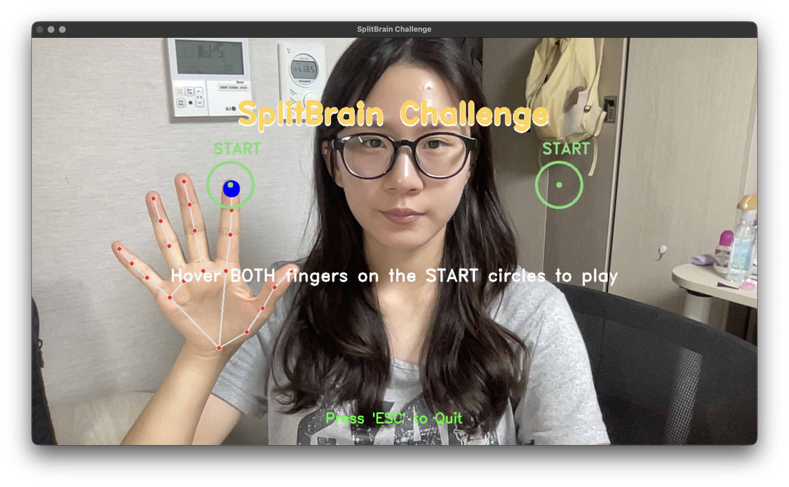
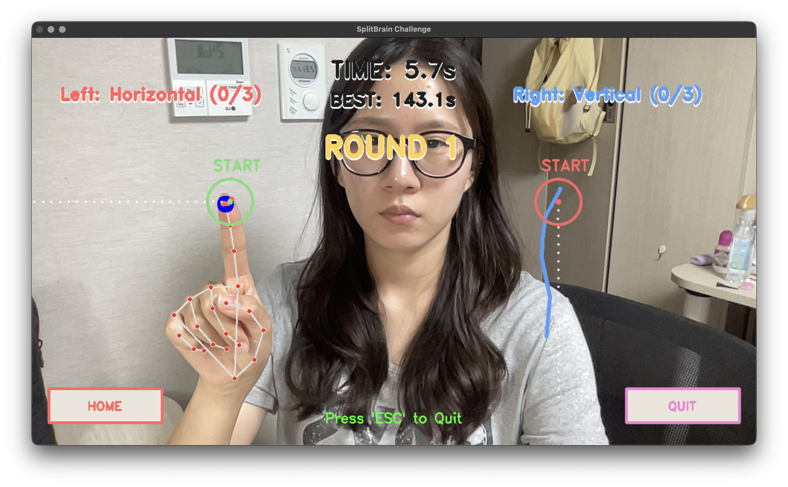
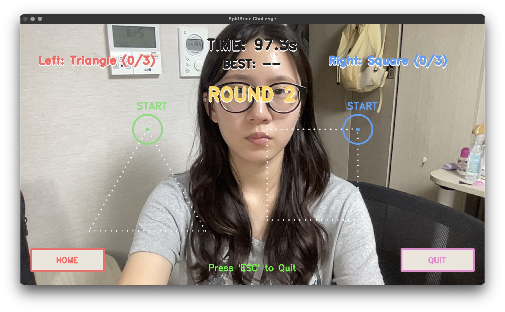
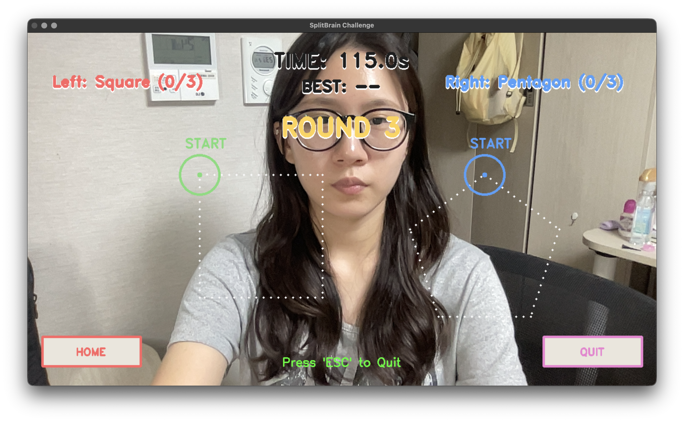
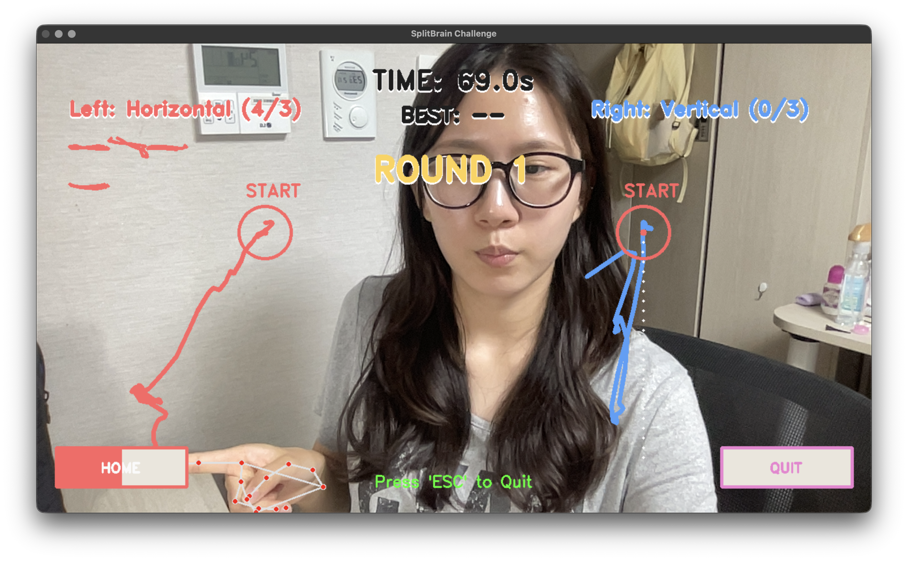
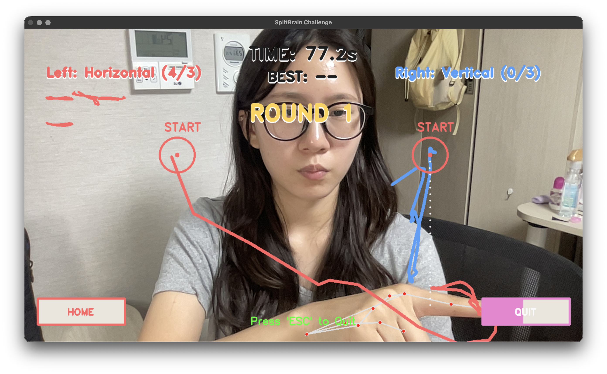
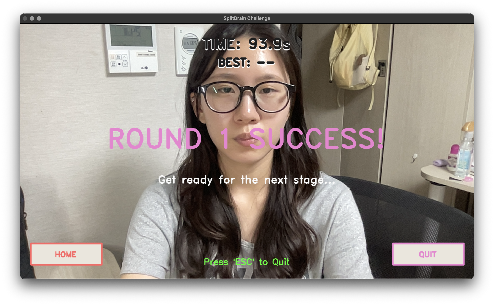
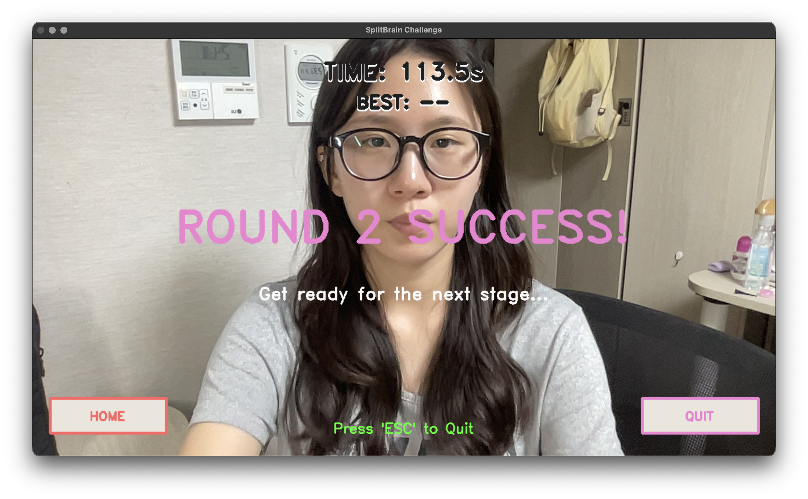
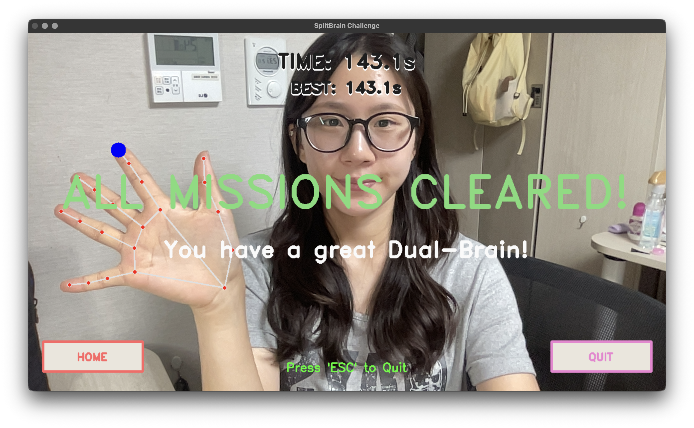
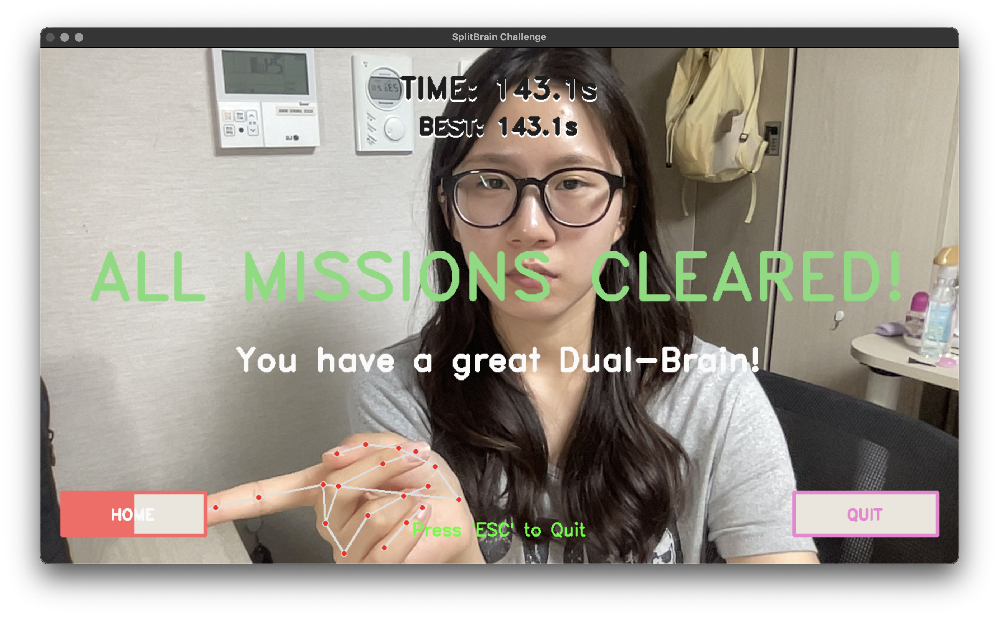

# 🧠 SplitBrain Challenge (스플릿브레인 챌린지)

SplitBrain Challenge는 웹캠 앞 허공에 양손 검지손가락을 이용해 동시에 서로 다른 도형을 그리는 좌우뇌 독립 제어(멀티태스킹) 한계 테스트 게임입니다.

MediaPipe의 실시간 손가락 추적 기술과 OpenCV의 수학적 도형 판별 알고리즘을 결합하여, 사용자의 손가락 궤적을 실시간으로 분석하고 채점합니다. 단순한 동작 인식을 넘어, 엄격한 꼼수 방지 로직과 스피드런(최단 시간) 요소가 결합된 완성도 높은 컴퓨터 비전 기반의 인터랙티브 게임입니다.

## ✨ 주요 기능 및 특징 (Key Features)

- **실시간 양손 독립 추적:** 웹캠을 통해 양손 검지손가락의 좌표를 프레임 단위로 추출하며, 거울 모드를 지원하여 직관적인 플레이가 가능합니다.
- **비동기식 멀티태스킹 평가:** 양손의 성공 횟수를 개별적으로 관리합니다. 한 손이 미션을 먼저 달성해도 다른 손은 게임을 계속 진행할 수 있는 완벽한 독립형 채점 시스템을 구현했습니다.
- **엄격한 꼼수 방지 및 유연한 채점 알고리즘:** Convex Hull로 손떨림 노이즈를 제거하고, 다각형의 꼭짓점 판별 알고리즘을 고도화했습니다. 특히 **삼각형은 판정 기준을 완화**하여 플레이 편의성을 높였고, **사각형은 가로세로 비율(0.7~1.3)을 체크**하여 깐깐하게 정사각 형태만을 인정합니다. 또한, 점에 완벽히 닿지 않아도 **시작점(Anchor) 영역 안으로 들어오기만 하면 완성으로 인정**해주는 UX 로직을 적용했습니다.
- **스피드런 타이머 및 최고 기록 갱신:** 게임 시작과 동시에 타이머가 작동하며, 3라운드 최종 클리어 시 소요된 시간을 측정하여 최고 기록(BEST TIME)을 갱신하는 경쟁 요소를 도입했습니다.
- **동적 인터랙션(Hovering Gauge) 버튼:** 모든 버튼(START, HOME, QUIT)은 손가락을 1초간 올려두면 색상이 채워지는 게이지 시스템을 통해 오작동을 방지하고 직관적인 조작을 지원합니다.
- **사용자 친화적 UI 및 완벽한 대칭 레이아웃:** - 모든 텍스트에 **보색 테두리(그림자) 효과**를 적용하여 영상 위에서도 명확한 가독성을 제공합니다.
- 타이틀과 ROUND 문구는 **화면 중앙 상단에 최적화된 위치로 재배치**하였으며, 게임 요소들은 좌우 대칭 레이아웃으로 균형 잡힌 UI를 구성했습니다.
- 성공한 도형은 1.3배 크기 텍스트 아래에 **3개 단위로 줄바꿈되어 도장처럼 박제**됩니다.

- **동시 시작 시스템(Dual-Start):** 게임 시작 시 양손을 각각의 시작점(Anchor) 원에 동시에 올려두어야 게임이 시작되도록 하여 멀티태스킹 게임의 정체성을 강화했습니다.

## 🎮 데모 및 실행 화면 (Demo & Screenshots)

<div align="center">
  
</div>

### 1. 플레이 데모 영상 (GIF)

**설명:** 양손을 독립적으로 사용하여 서로 다른 도형을 동시에 그리는 모습입니다. 2개의 시작점에 손을 올려 시작하며, 도형 완성 시 중앙 기준 좌우로 미니 도형이 박제됩니다.

### 2. 게임 상태별 스크린샷

- **대기 화면 (WAITING):** 중앙 위쪽의 타이틀과 안내 문구를 확인하고, 양손을 각 앵커에 올려 1초간 게이지를 채우면 시작됩니다.
<div align="center">
  
</div>

- **라운드 진행 중 (PLAYING):** 중앙 정렬된 타이머와 좌우로 대칭 배치된 미션 도형을 따라 그립니다. 좌측 하단의 HOME 버튼으로 언제든 대기 화면으로 복귀 가능하며 QUIT 버튼으로 즉시 종료 가능합니다.
<div align="center">
  
  
  
  <br>
  
  
</div>

- **라운드 클리어 (ROUND CLEAR):** 양손 모두 3회 성공 시 속도감 있는 전환 이펙트와 함께 다음 라운드로 이동합니다.
<div align="center">
  
  
</div>

- **최종 클리어 (ALL CLEARED):** 3라운드를 모두 통과하면 최고 기록(BEST TIME)이 표시되며 축하 메시지가 나타납니다.
<div align="center">
  
  
</div>                                                                                                                                  |

## 🛠 필수 라이브러리 및 설치 방법 (Prerequisites)

이 프로젝트는 Python 환경에서 동작하며, 외부 API 연동 없이 로컬에서 가볍게 실행됩니다.

```bash
pip install opencv-python mediapipe numpy

```

## 🚀 실행 방법 (How to Run)

터미널에서 프로젝트 폴더로 이동한 뒤, 메인 파이썬 파일을 실행합니다.

```bash
python main.py

```

- **조작 방법:** 대기 화면에서 양쪽 손가락을 각각의 초록색 시작점(Anchor)에 대고 1초간 기다리면 시작됩니다. 미션 도형 궤적을 그리고 다시 시작점 안으로 돌아오면 채점됩니다.
- **HOME/종료:** 좌측 하단의 HOME 영역에 손가락을 대면 대기 화면으로 복귀하며, 우측 하단의 QUIT으로 종료합니다. (ESC 키로도 즉시 종료 가능)

## 📁 파일 구성 및 모듈별 역할 (File Structure & Modules)

객체 지향 프로그래밍(OOP)의 단일 책임 원칙(SRP)과 합성(Composition) 원칙을 준수하여 설계되었습니다.

1. **`main.py` (메인 컨트롤러):** 프로그램의 진입점. 웹캠 루프 제어 및 전체 데이터 흐름 통제.
2. **`hand_tracker.py` (손가락 추적):** MediaPipe Hands 기반 검지손가락 랜드마크 추출 및 양손 분리.
3. **`shape_recognizer.py` (궤적 판별):** 노이즈 보정(`Convex Hull`), 다각형 단순화(`approxPolyDP`) 및 사각형 비율 판별 로직 구현.
4. **`game_manager.py` (상태 머신):** FSM 패턴 기반 게임 상태 관리, 비동기 점수 기록 및 양손 동시 인식(Dual-Anchor) 호버 게이지 시스템.
5. **`ui_renderer.py` (시각 효과):** 보색 테두리 텍스트 렌더링, 완벽한 좌우 대칭 레이아웃 배치, 삼각함수 기반 대칭 점선 가이드 생성.

## ⚖️ License & Acknowledgements

### 🤖 생성형 AI 활용 명시 (Development AI Assistance)

본 프로젝트는 기획한 아이디어와 시스템 아키텍처(OOP, FSM)를 바탕으로, 빠르고 최적화된 코드 구현을 위해 **Google Gemini**의 코딩 어시스턴트 지원을 받아 개발되었습니다. 단순한 코드 복붙이 아닌, AI와의 페어 프로그래밍 방식을 통해 수학적 알고리즘 튜닝과 정밀한 UI 좌표 정렬을 직접 구현하고 수정했습니다.

### 📚 References

- **Google MediaPipe Hands API** ([Docs](https://developers.google.com/mediapipe/solutions/vision/hand_landmarker))
- **OpenCV Structural Analysis** ([Docs](https://www.google.com/search?q=https://docs.opencv.org/4.x/d3/dc0/group__imgproc__shape.html))
- **Numpy & Math:** 배열 연산 및 삼각함수 기반 기하학적 렌더링 활용
